<!--
═══════════════════════════════════════════════════════════════════
  Profile README for github.com/Murtaza-Motagam
  (Project repo links at the bottom are placeholders — fill when ready)
═══════════════════════════════════════════════════════════════════
-->

<!-- ====================== TERMINAL HEADER ====================== -->
<div align="center">

<!-- custom designed banner (lives in /assets) -->


<br/>


</div>

</div>

---

## 👋 About Me

```ts
const murtaza: SoftwareEngineer = {
  role: "Frontend Software Engineer",
  company: "Refrens",
  focus: ["UI/UX", "Performance", "Accessibility", "State Management", "API Integration"],
  stack: {
    web:     ["React", "Next.js", "TypeScript", "styled-components"],
    mobile:  ["React Native", "Expo"],
    backend: ["Node.js", "FeathersJS", "MongoDB"],
    tooling: ["GitHub", "Git", "Npm"]
  },
  philosophy: "Clean code, sharp UX, and details that ship.",
};
```

- 🔭 Production-grade web & mobile apps — interfaces to APIs.
- ⚛️ Advanced React — Hooks, custom hooks, memoization, context, refs, taming re-renders & stale closures.
- 🗂️ State management — Context API, reducers, predictable data flow.
- ⚙️ Full-stack range: React / Next.js + FeathersJS / MongoDB.
- 📱 React Native + Expo.
- 🌿 Version control — Git & GitHub CLI, branching, PR review workflows, CI-friendly habits.
- 💬 Ask me about React, Next.js, performance optimization, or debugging.

---

## 🛠️ Tech Stack

### Languages


### Frontend


### Mobile


### Backend & Database


### Tooling


---

### 🔥 Streak

<div align="center">


</div>

### 📈 Contribution & Commit Activity

<div align="center">


</div>

---

---

## 🚀 Featured Projects

<!-- Duplicate a block per project. Add repo links once your repos are public. -->

<div align="center">

<table>
<tr>
<td width="50%" valign="top">

### 🌐 Web Platform
A modern, high-performance web application built with **Next.js + React + TypeScript**, styled with **styled-components** and backed by a **FeathersJS / MongoDB** API.

`Next.js` `React` `TypeScript` `FeathersJS` `MongoDB`

<!-- [](https://github.com/Murtaza-Motagam/REPO) -->

</td>
<td width="50%" valign="top">

### 📱 Cross-Platform Mobile App
A cross-platform mobile experience built with **React Native + Expo**, sharing logic with the web stack and consuming the same backend services.

`React Native` `Expo` `TypeScript` `Node.js`

<!-- [](https://github.com/Murtaza-Motagam/REPO) -->

</td>
</tr>
</table>

</div>

> 💡 **Tip:** Pin your best repositories on your profile (GitHub → your profile → *Customize your pins*) so they show right under this README.

---

<div align="center">

```bash
murtaza@github:~$ exit
> Thanks for stopping by — check out the pinned repos ⭐
```

</div>
